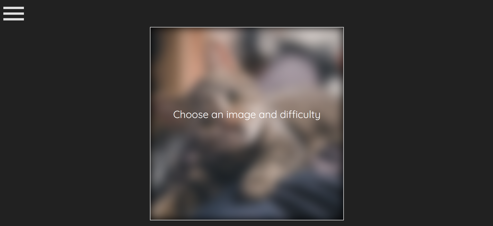
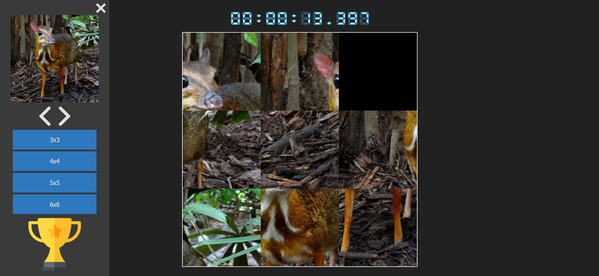
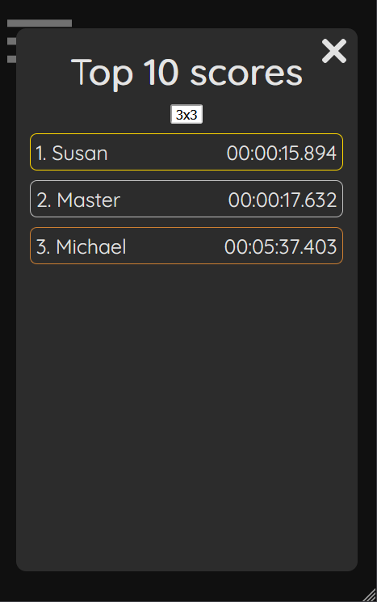
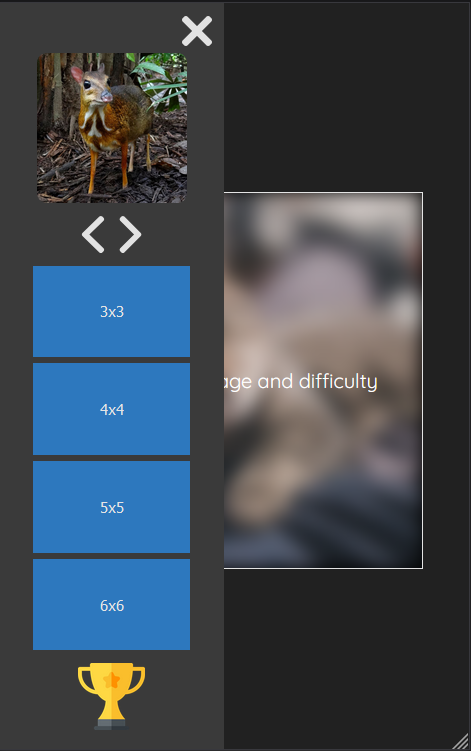

# Fifteen-Puzzle &middot;  

Simple puzzle game made in Javascript and HTML. Check out live: https://michalbie.github.io/Fifteen-Puzzle/

## Game rules
Rearrange tiles to recreate the original image! You can choose 4 difficulty levels and 3 images from the sidebar.

## Game look

## Contribution
If you want to contribute, please create new pull request or open an issue. Copy my .editorconfig file and follow rules from this link [Style Guide](https://github.com/bevacqua/js 
"bavacqua style guide").

